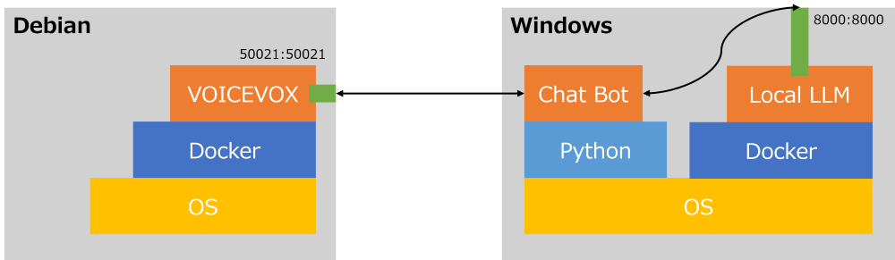

# README
VOICEVOX とローカル LLM (ELYZA) を組み合わせて簡易ボイスチャットボットを作ります。

## 前提
- VOICEVOX と ローカル LLM は別のサーバで動かすことを想定しているので、`docker-compose.yml` ファイルを分けています。

## 動作確認環境
- VOICEVOX
  - OS: Debian 11.8 (on Proxmox)
  - RAM: 8GB
  - Docker version 24.0.7
- ローカルLLM (ELYZA)
  - OS: Windows 11
  - RAM: 64GB
  - VRAM: 12GB (NVIDIA GeForce RTX 3060)
    - Cuda 12.3
  - Docker Desktop 4.27.1

---

構成イメージ：



## 準備
### VOICEVOX Engine の起動

サーバ上に構築した [VOICEVOX](https://voicevox.hiroshiba.jp/) の音声合成エンジンを起動します。

```
$ docker compose -f voicevox/docker-compose.yml up
```

### ローカルLLM の起動
今回はローカル LLM として、ELYZAさんが公開している [ELYZA-japanese-Llama-2-13b-fast-instruct](https://huggingface.co/elyza/ELYZA-japanese-Llama-2-13b-instruct) の gguf フォーマット変換版 ([ELYZA-japanese-Llama-2-13b-fast-instruct-gguf](https://huggingface.co/mmnga/ELYZA-japanese-Llama-2-13b-fast-instruct-gguf)) を使います。

このモデル (`*.gguf` 形式) を `llm/model` 以下に配置します。また、`llm/` 以下に `.env` ファイルを作成し、以下の環境変数を定義します。

```
MODEL=[Your Model Path]
N_GPU_LAYERS=[Num of GPU Layers]
```

ここまでをまとめると、 `llm/` 以下は次のようなディレクトリ構成にする、ということです。

```
|- llm/
|   |- docker-compose.yml
|   |- Dockerfile
|   |- .env
|   |- model/
|   |   |- *.gguf
```

ローカル LLM を構築するために、[llama-cpp-python](https://pypi.org/project/llama-cpp-python/) を使います。ローカル LLM サーバ (ここでは、Windows 11) を API で使えるようにします。

```
$ docker compose -f llm/docker-compose.yml build
$ docker compose -f llm/docker-compose.yml up
```

今回は Windows 11 にローカル LLM サーバを立てたので、Windows 11 から `127.0.0.1:8000` で API にアクセスできます。

## Usage
```
usage: voicechat.py [-h] [-s SPEAKER] [-r RETRY] [--history HISTORY] [--vhost VHOST] [--vport VPORT]
                    [--lhost LHOST] [--lport LPORT] [--system SYSTEM]

Voice Chat to VOICEVOX

options:
  -h, --help            show this help message and exit
  -s SPEAKER, --speaker SPEAKER
                        the speaker id of the VOICEVOX character
  -r RETRY, --retry RETRY
                        maximum limit of retry
  --history HISTORY     the path of chat history file
  --vhost VHOST         VOICEVOX host
  --vport VPORT         Port of VOICEVOX
  --lhost LHOST         Local LLM host
  --lport LPORT         Port of Local LLM
  --system SYSTEM       System Prompt of Local LLM
```

## 動作確認
合成音声：「VOICEVOX:春日部つむぎ」

LLM のシステムプロンプトは、[VOICEVOX 春日部つむぎ](https://voicevox.hiroshiba.jp/product/kasukabe_tsumugi/) を参考に作りました。

[](https://www.youtube.com/watch?v=QUvJxU_WWB0)

## 参考
- [Python Bindings for llama.cpp](https://llama-cpp-python.readthedocs.io/en/latest/)
- [Llama2をDockerで実行する](https://qiita.com/ryome/items/4122ab3744e3c3785c7f)
- [Orange Pi 5で「ELYZA-japanese-Llama-2-13b」を動かしてみた](https://www.wasp.co.jp/blog/350)
- [llama-cpp-pythonを用いたllama2制御に必要なVRAMの調査](https://qiita.com/youha/items/6086b87dc86a9ba4bf37)
- [【cuBLAS】llama-cpp-pythonでのGPU推論入門](https://zenn.dev/saldra/articles/8785e45e1db493)
- [ローカルPCでLLMを動かす（llama-cpp-python）](https://www.insurtechlab.net/run_llm_on_localmachine_using_lama_cpp_python/)